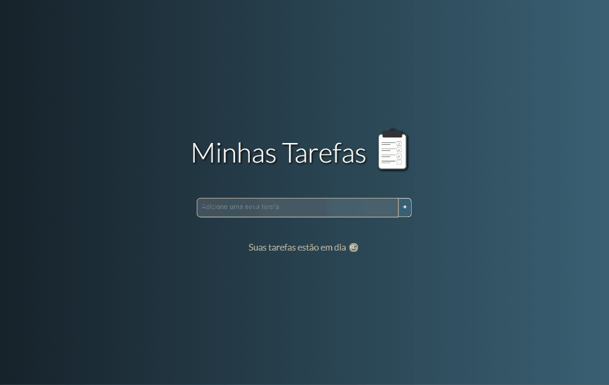
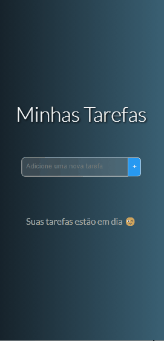

<h1 align="center">To-do List Express</h1>

To-do List Express é uma aplicação construída com Vue.js, projetada para facilitar o gerenciamento de tarefas de forma simples e intuitiva. A interface oferece várias funcionalidades essenciais para uma experiência completa:

📝 Adicionar Tarefa: Os usuários podem adicionar novas tarefas, com validação que impede a inclusão de tarefas vazias ou duplicadas.

👁️ Visualização das Tarefas: Cada tarefa adicionada aparece destacada em vermelho, indicando que está pendente. Ao clicar na tarefa, ela é marcada como concluída, mudando automaticamente para verde. O status da tarefa pode ser alternado entre pendente e concluído a qualquer momento, facilitando a distinção clara e rápida entre tarefas que ainda precisam ser feitas e aquelas já finalizadas.

💬 Notificação de Estado: Ao clicar em uma tarefa para marcá-la como pendente ou concluída, um balão de notificação aparece brevemente para indicar a mudança de estado da tarefa e desaparece após alguns instantes.

🗑️ Excluir Tarefa: Cada tarefa possui um botão de exclusão, permitindo que o usuário remova tarefas individualmente.

📊 Barra de Progresso: A barra de progresso exibe visualmente a porcentagem de tarefas concluídas, com a cor de preenchimento ajustando-se conforme o avanço.

🚮 Excluir Todas as Tarefas: Para uma limpeza rápida, o usuário pode usar o botão de lixeira, que abre um alerta de confirmação para excluir todas as tarefas de uma vez.

💾 Armazenamento das Informações: As tarefas são armazenadas localmente no navegador usando o localStorage, garantindo que as informações persistam entre sessões e recarregamentos da página. Isso permite que os usuários mantenham suas tarefas e o progresso mesmo após fechar e reabrir a aplicação.

📱 Responsividade: A aplicação é projetada para ser responsiva e se adaptar a diferentes tamanhos de tela, desde dispositivos móveis até desktops. A interface ajusta seu layout e elementos para garantir uma experiência de usuário otimizada em várias plataformas.

O objetivo é gerenciar as tarefas de forma eficiente, com uma interface intuitiva e responsiva. Este projeto demonstra habilidades em Vue.js, validação de formulários e manipulação dinâmica de elementos.

Para ver o projeto pronto [clique aqui 🖱️](https://clari-cassia-projetcs-to-do-list.vercel.app/)

<h2 align="center">Layouts: Desktop / Mobile</h2>

    
    

<h2 align="center"> O que eu aprendi</h2>

Ao concluir este projeto aprendi a importância de validação de dados implementando validações para garantir que tarefas duplicadas ou vazias não fossem adicionadas, aprimorando a integridade dos dados, pide compreender mais sobre como gerenciar entradas e feedbacks dinâmicos em tempo real.

Também pude explorar o uso de classes dinâmicas para alterar a aparência das tarefas conforme o status delas mudava, aplicando estilos diferentes para indicar tarefas pendentes ou concluídas. A implementação da barra de progresso foi outro ponto-chave, onde utilizei a reatividade do Vue.js para atualizar automaticamente o progresso de acordo com a conclusão das tarefas.

Ao adicionar a funcionalidade de notificação para mudanças de estado das tarefas, utilizei o setTimeout para exibir um balão de notificação que desaparece após alguns instantes. Esse recurso me ensinou sobre a importância de gerenciar a visibilidade temporária de elementos e de como utilizar métodos e temporizadores para criar feedbacks visuais dinâmicos e interativos

Trabalhando com o objeto data, aprendi a gerenciar o estado da aplicação, garantindo que todas as tarefas fossem armazenadas e atualizadas de forma eficiente. O uso de métodos como computed me permitiu monitorar mudanças no estado das tarefas e ajustar elementos visuais e funcionais de acordo com essas mudanças, mantendo o código enxuto e fácil de manter.

Além disso, aprendi a utilizar o Local Storage para persistir dados entre sessões, o que garantiu que as tarefas fossem salvas mesmo após o fechamento do navegador. A implementação de um design responsivo também foi um aprendizado importante, permitindo que o aplicativo se adaptasse a diferentes tamanhos de tela e dispositivos, oferecendo uma experiência de usuário consistente e agradável.

Esse projeto me proporcionou uma visão mais ampla de como Vue.js facilita a criação de interfaces interativas e responsivas, além de reforçar meu entendimento sobre gerenciamento de estado e manipulação de elementos dinâmicos

<h2 align="center">Tecnologias utilizadas</h2>

  
  
  

